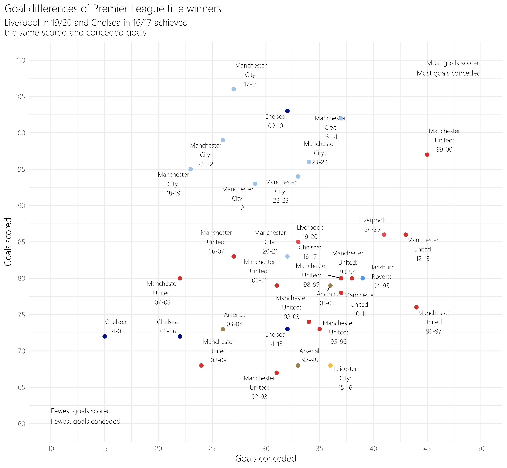
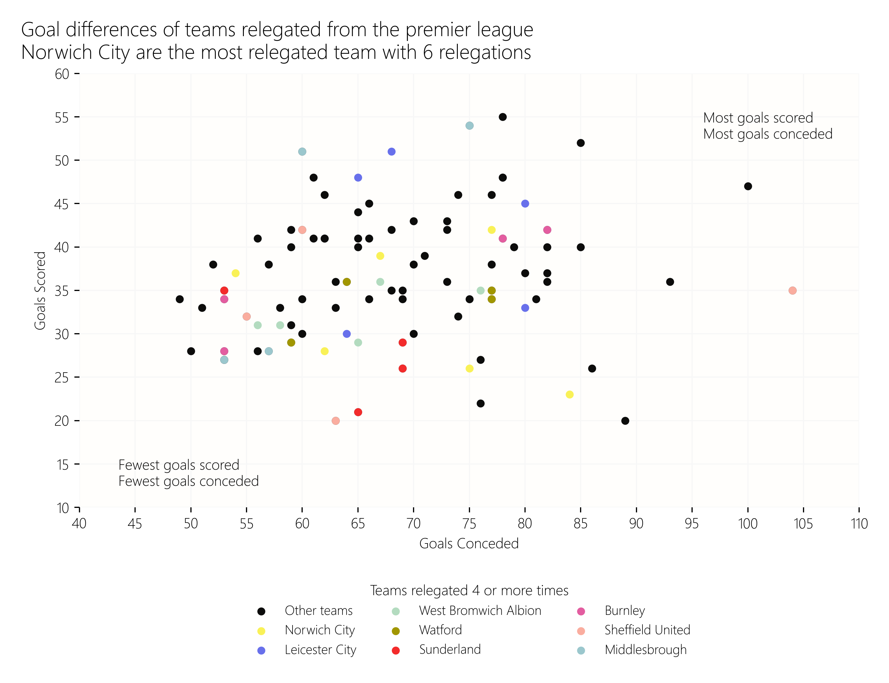

# Data on all Premier League tables ⚽

Data has been pulled from wikipedia. It contains all the premier league tables, which have then been unified, with a column added to indicate the year. 

To get to the data. 

```{r}
# option 1 - load using readr
prem_league_tables <- readr::read_csv("https://raw.githubusercontent.com/andrewmoles2/premier_league_tables/refs/heads/master/data/premier_league_tables.csv")

# option 2 - load using base R read.csv
prem_league_tables <- read.csv("https://raw.githubusercontent.com/andrewmoles2/premier_league_tables/refs/heads/master/data/premier_league_tables.csv")
``` 

For Python:

```{python}
import pandas as pd

prem_league_tables = pd.read_csv("https://raw.githubusercontent.com/andrewmoles2/premier_league_tables/refs/heads/master/data/premier_league_tables.csv")
```

An example visual that can be made with this data. This is a replica (of sorts) based on a visual found in this [BBC article](https://www.bbc.co.uk/sport/football/articles/ce3xqv0k6xgo). 



This is another visual, doing something very similar but with teams relegated. 

